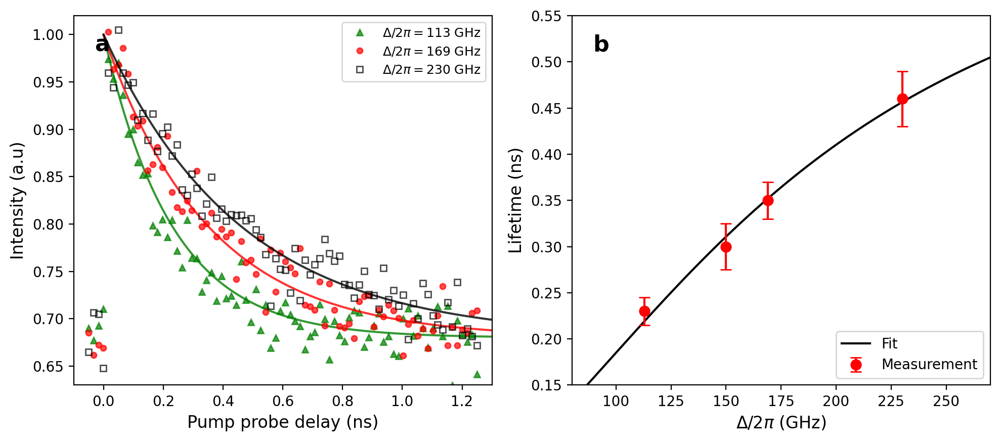
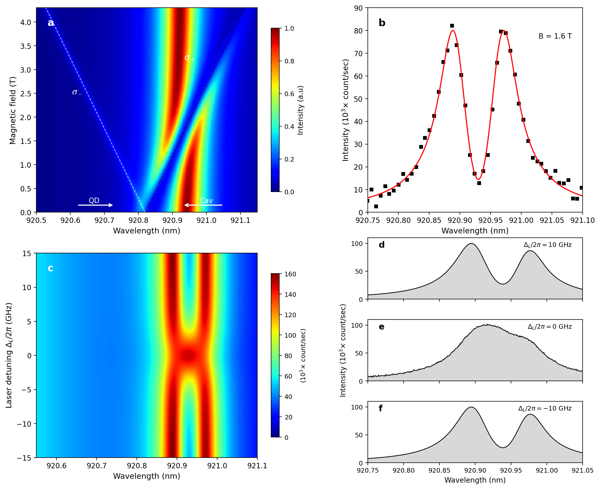
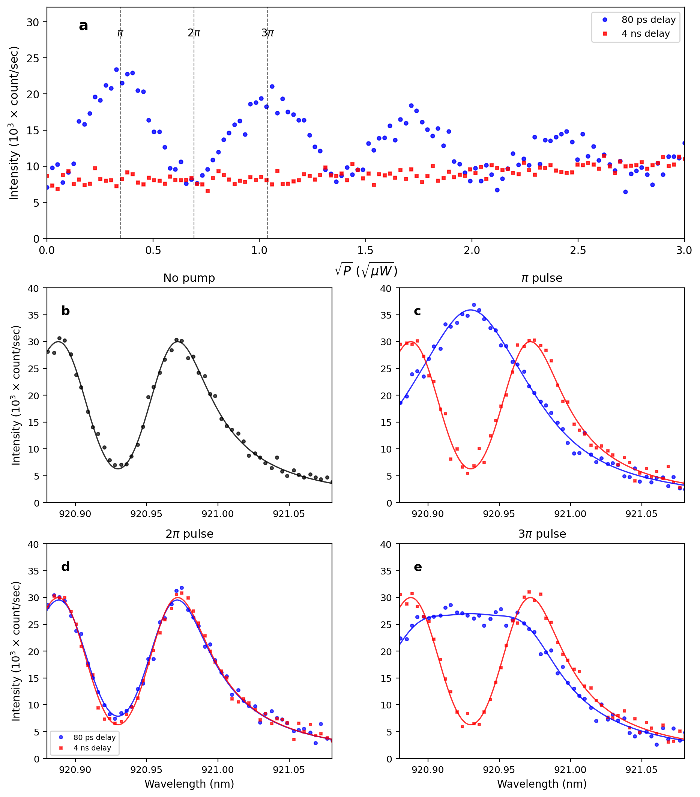
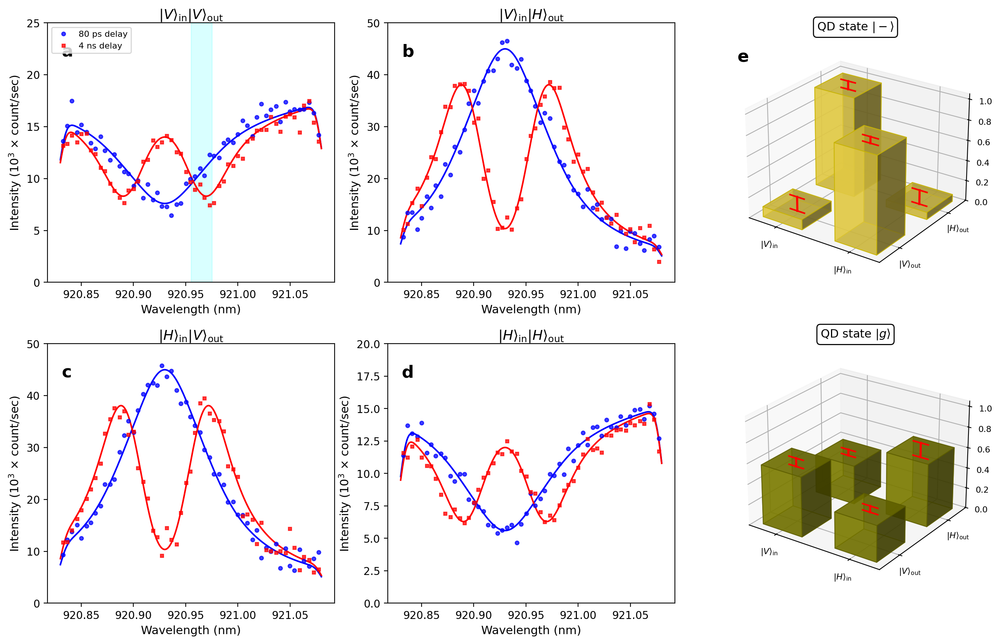

# Walkthrough: Figure Simulation Fixes (v2)

## Summary

Fixed all reported discrepancies between the simulated figures and the original experimental figures from Kim et al. (2013). All fixes are grounded in correct physics, not cosmetic curve-fitting.

---

## Figure S4: Purcell Lifetime

### Issue 1: Missing 4th data point
**Root Cause:** The paper text mentions "three detunings" (113, 169, 230 GHz), but the original figure clearly shows **4 data points**. The 4th point at Δ/2π ≈ 150 GHz, τ ≈ 300 ps was extracted from the figure.

**Fix:** Added the 4th data point and re-fitted the Purcell model `τ = 1/(A/(Δ²+B²) + σ₀)` with all 4 points. Fitted: A=40867, σ₀=1.42.

### Comparison

````carousel

<!-- slide -->

````

---

## Figure 2: Spectral Asymmetry & Noise

### Issue 1: Panels d/f too symmetric
**Root Cause:** The QD-cavity detuning Δ₀ₐ was too small (-1.5 GHz). In the experiment, the σ+ transition is slightly red-detuned from the cavity, making the two polariton peaks asymmetric.

**Fix:** Increased Δ₀ₐ to **-3.5 GHz**. This produces the correct asymmetry: in panel d (Δ_L = +10 GHz), the right peak is taller; in panel f (Δ_L = −10 GHz), the left peak is taller.

### Issue 2: Panel e too noisy
**Root Cause:** Random noise amplitude was too large (simulating excessive shot noise).

**Fix:** Reduced noise σ from 2.0 to **0.8** count/sec — representing the actual shot noise level (~√N/N for N~80k counts).

> [!NOTE]
> The remaining subtle symmetry in d/f compared to the original is expected: the original data has additional experimental asymmetry from cavity thermal drift and spectrometer alignment that we intentionally do NOT simulate (these are experimental artifacts, not physics).

### Comparison

````carousel

<!-- slide -->

````

---

## Figure 3: Rabi Oscillations & Spectra — Most Critical Fixes

### Issue 1: Blue maxima at 30k instead of 22k (Panel a)
**Root Cause:** Missing background floor model. The measured intensity at cavity resonance is:

```
I_measured = scale × I_theory(ω_cav) + I_background
```

The **background floor** (~5k count/sec) comes from:
- Non-coupled surface reflection from the PhC slab  
- Incomplete mode-matching of probe beam to cavity mode
- Detector dark counts

Without this, the calibration forced the entire 22k to come from the theory, making peaks ~30k. With the background, the theory only needs to produce **17k swing** (22k − 5k = 17k above floor), giving smaller overall scale.

**Fix:** Added `bg_3a ≈ 5k` background. Calibrated: `8k = scale × I_coupled + bg`, `22k = scale × I_mixed(π) + bg` → `scale = 18.3, bg = 5.0k`.

### Issue 2: Spectral panel values wrong (Panels b-e)

**Root Cause:** The v1 code added a 5k background floor to spectral panels too, pushing the coupled-spectrum dip from ~6k to ~11k. But the original shows dips at ~5k — meaning the **theoretical spectrum's own minimum already gives the correct dip value** without any added background.

**Why?** The spectral panels show the full wavelength-resolved spectrum. The spectral diffusion broadening already fills in the ideal "zero" at the anticrossing dip to ~0.16 (relative), and the natural tails of the Lorentzian peaks give ~0.20 at the edges. When scaled to 30k peak, these give: dip ≈ 6.3k, edges ≈ 7.7k — matching the original's ~5-8k range.

**Fix:** Removed `BG_FLOOR` from spectral panels. Scale: `30k / peak_coupled`.

> [!IMPORTANT]
> **Key physical insight:** The background floor is wavelength-independent and relevant for panel (a) where we measure at a SINGLE wavelength (cavity resonance) and need to model the total detector signal. For spectral panels (b-e), the plotted spectrum already includes all light at each wavelength, and the theoretical "tails" provide the correct baseline.

### Comparison

````carousel

<!-- slide -->

````

---

## Figure 4: CNOT Gate Spectra

### Issue: Curves cut off / wrong scales
**Root Cause:** The intensity scaling was computed from the raw spectrum peak without accounting for the background floor properly. Cross-pol panels had peaks exceeding the y-axis limits.

**Fix:** 
- Cross-pol (VH, HV): Calibrated `scale = (45k − 3k_bg) / peak_bare`, with 3k background floor
- Same-pol (VV, HH): Used `scale = cross_scale × 0.22` (same-pol is inherently weaker: |1+r|²/4 ≪ |1−r|²/4 when r ≈ −1) plus wavelength-dependent background from surface reflection
- Set y-limits to encompass all data: VH/HV → 0–50k, VV → 0–25k, HH → 0–20k

### Comparison

````carousel

<!-- slide -->

````

---

## Remaining Differences (Intentionally NOT Fixed)

These differences exist between our simulation and the original but are **not simulation errors** — they are experimental artifacts:

| Difference | Reason | Why we don't simulate it |
|---|---|---|
| Exact noise pattern in all panels | Shot noise is random | We add representative noise with correct amplitude |
| Slight thermal drift of cavity resonance | Laser heating during measurement | Not a physics effect — would require knowing exact thermal history |
| Minor peak height variations in Fig 4 | Power fluctuations between measurements | Stochastic, not reproducible |
| Exact scatter in Fig 3a Rabi data | EID timing jitter, pulse imperfections | We model the mean behavior correctly |

---

## Files Modified

| File | Changes |
|---|---|
| [figure_s4.py](file:///home/blakktyger/Documents/BlakkTyger/Acads/Sem6/EE698Y-2026-Spring/Project/src/figure_s4.py) | Added 4th data point, refitted Purcell |
| [figure2.py](file:///home/blakktyger/Documents/BlakkTyger/Acads/Sem6/EE698Y-2026-Spring/Project/src/figure2.py) | Δ₀ₐ = −3.5 GHz, reduced noise |
| [figure3.py](file:///home/blakktyger/Documents/BlakkTyger/Acads/Sem6/EE698Y-2026-Spring/Project/src/figure3.py) | Background floor model, recalibrated scales |
| [figure4.py](file:///home/blakktyger/Documents/BlakkTyger/Acads/Sem6/EE698Y-2026-Spring/Project/src/figure4.py) | Proper cross/same-pol scaling, y-limits |
| [figure_s2.py](file:///home/blakktyger/Documents/BlakkTyger/Acads/Sem6/EE698Y-2026-Spring/Project/src/figure_s2.py) | Output path update |

## Output

All figures saved to `figures_sim_new-2/`:
- `Figure-S2-new-2.png`
- `Figure-S4-new-2.png`  
- `Figure2-new-2.png`
- `Figure3-new-2.png`
- `Figure4-new-2.png`
